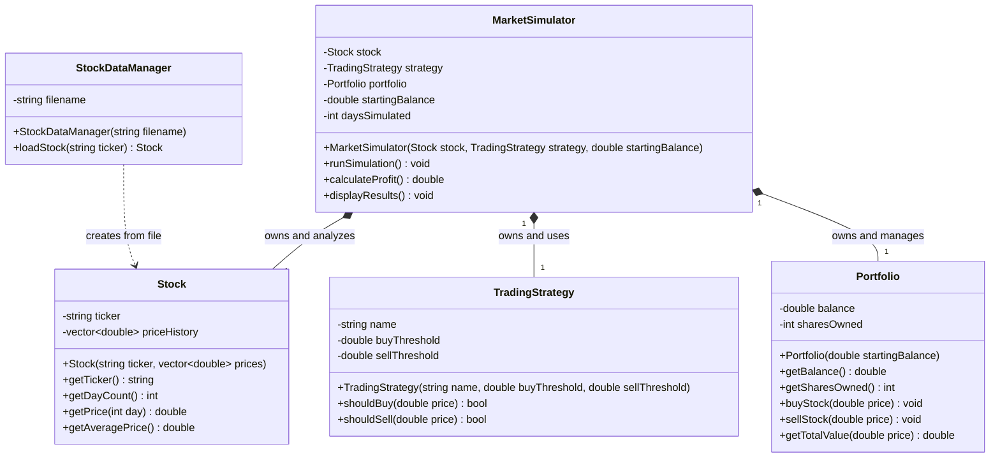

# Major-Project-Market-SImulator

```mermaid 
classDiagram
    class Stock {
        -string ticker
        -vector~double~ priceHistory
        +Stock(string ticker, vector~double~ prices)
        +getTicker() string
        +getDayCount() int
        +getPrice(int day) double
        +getAveragePrice() double
    }

    class TradingStrategy {
        -string name
        -double buyThreshold
        -double sellThreshold
        +TradingStrategy(string name, double buyThreshold, double sellThreshold)
        +shouldBuy(double price) bool
        +shouldSell(double price) bool
    }

    class Portfolio {
        -double balance
        -int sharesOwned
        +Portfolio(double startingBalance)
        +getBalance() double
        +getSharesOwned() int
        +buyStock(double price) void
        +sellStock(double price) void
        +getTotalValue(double price) double
    }

    class StockDataManager {
        -string filename
        +StockDataManager(string filename)
        +loadStock(string ticker) Stock
    }

    class MarketSimulator {
        -Stock stock
        -TradingStrategy strategy
        -Portfolio portfolio
        -double startingBalance
        -int daysSimulated
        +MarketSimulator(Stock stock, TradingStrategy strategy, double startingBalance)
        +runSimulation() void
        +calculateProfit() double
        +displayResults() void
    }

    MarketSimulator "1" *-- "1" Stock : owns and analyzes
    MarketSimulator "1" *-- "1" TradingStrategy : owns and uses
    MarketSimulator "1" *-- "1" Portfolio : owns and manages
    StockDataManager ..> Stock : creates from file
```
